<p align="center">
  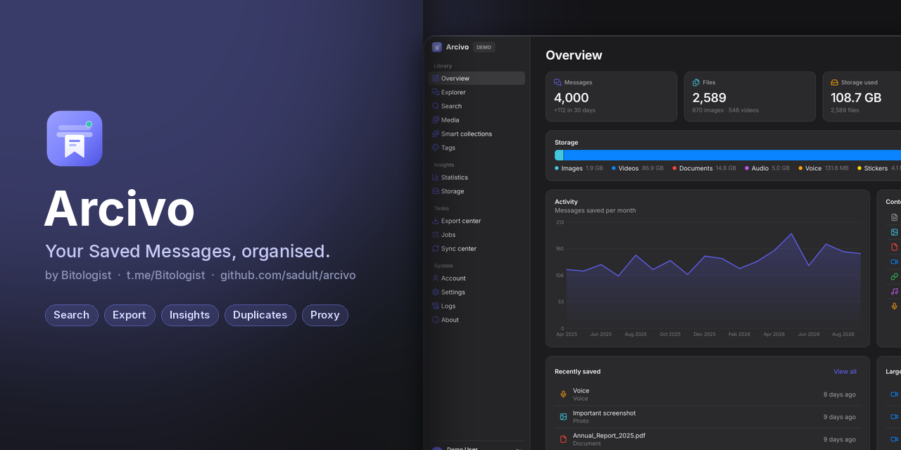
</p>

<p align="center">
  <a href="https://github.com/sadult/arcivo/actions/workflows/ci.yml"></a>
  <a href="https://github.com/sadult/arcivo/releases"></a>
  
  
  <a href="LICENSE"></a>
</p>

**Arcivo** is a fast, private, local-first desktop app for **managing your Telegram Saved Messages** on Windows.
It indexes everything you've saved – files, music, voice notes, videos, links and notes – so you can search it
instantly, see where your storage goes, find duplicates, organise with tags and smart collections, export to
open formats, and clean up safely.

> [!IMPORTANT]
> Arcivo is an **independent, open-source app that uses the [Telegram API](https://core.telegram.org/api)**.
> It is **not** made, endorsed or supported by Telegram. You sign in with **your own API ID/hash**, and your data
> never leaves your computer except to talk to Telegram's own servers.

## Contents
[Features](#features) · [Screenshots](#screenshots) · [Install](#install) · [Getting API credentials](#getting-your-telegram-api-credentials) ·
[First run](#first-run) · [Console app](#console-app-arcivoexe) · [Filtered networks](#proxy--filtered-networks) · [CLI](#command-line) · [Search syntax](#search-syntax) · [Privacy & security](#privacy--security) ·
[Build](#building-from-source) · [Docs](#documentation) · [Contributing](#contributing) · [License](#license)

## Features

| | |
|---|---|
| 🔐 **Secure sign-in** | API ID/hash → phone → code → 2-step password, in the app or `arcivo login`. Session stored in Windows Credential Manager / DPAPI – never in plain files or logs. |
| ⚡ **Resumable sync** | Initial indexing resumes after interruptions; incremental sync catches new, edited and deleted messages. FLOOD_WAIT limits are honoured. |
| 🔎 **Instant search** | SQLite FTS5 plus a filter language: `type:audio size:>20MB after:2026-01-01 -tag:old sort:size`. |
| 🗂️ **Explorer & media** | Type tabs, filter panel, virtualised table for 100k+ messages, thumbnail grid, detail panel with preview, global selection with "select all matching". |
| 📊 **Statistics** | Timeline, types, categories, hours × weekdays heatmap, size distribution, top senders, sources and domains – every chart drills into the messages behind it. |
| 💾 **Storage analyzer** | What takes space by category and extension, largest files, **duplicate finder** (same file / same name+size / size+duration) with keep-oldest/newest. |
| 🏷️ **Organise** | Local tags (drag & drop), flags, private notes, smart collections (saved queries with live counts), undo. |
| 📦 **Export center** | JSON, JSON Lines, CSV, TXT, HTML report, Markdown; optional media download with folder/file-name templates; resumable; optional review-then-delete afterwards. |
| 🧰 **Jobs** | Every long task is a job: progress, pause/resume/cancel/retry, reports, survives restarts. |
| 🛡️ **Safe deletion** | Review list with counts and sizes, two-step typed confirmation, throttled batches, report + audit log. |
| 🍎 **Clean, macOS-style UI** | Calm sidebar, large titles, grouped inset lists, Apple system colours, dark & light themes, command palette (Ctrl+K), editable shortcuts. |
| 🖥️ **Console home screen** | Run `Arcivo.exe` for an arrow-key menu: sign in, open the dashboard, check connection, sync, proxy settings. |
| 🌐 **Proxy & diagnostics** | SOCKS5 / HTTP / MTProto proxy (paste a `t.me/proxy` link) and `arcivo doctor` to find out why Telegram can't be reached. |
| ⌨️ **Full CLI** | Everything scriptable: `doctor`, `proxy`, `sync`, `search`, `export`, `delete`, `stats`, `storage`, `tags`, `collections`, `db`, `cache`, `config`, `logs`. |
| 🧪 **Demo mode** | `--demo` runs the whole app on synthetic data – no account needed. |

## Screenshots

<table>
<tr>
<td width="50%">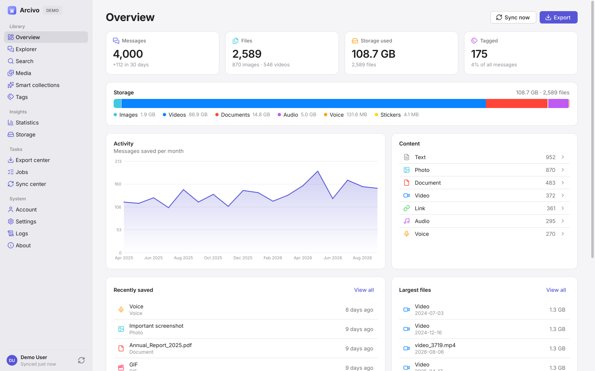<br><sub><b>Overview</b> – your archive at a glance</sub></td>
<td width="50%">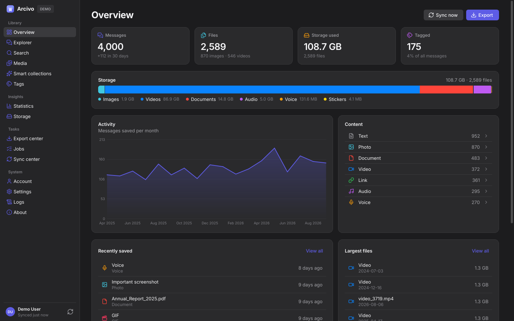<br><sub><b>Dark appearance</b></sub></td>
</tr>
<tr>
<td>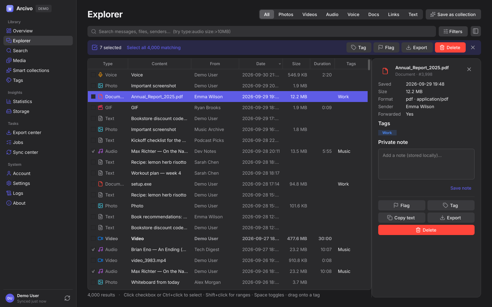<br><sub><b>Explorer</b> – filter, select and act in bulk</sub></td>
<td>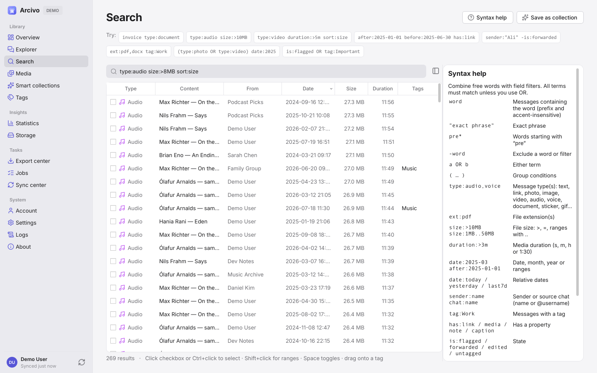<br><sub><b>Search</b> – powerful query language with built-in help</sub></td>
</tr>
<tr>
<td>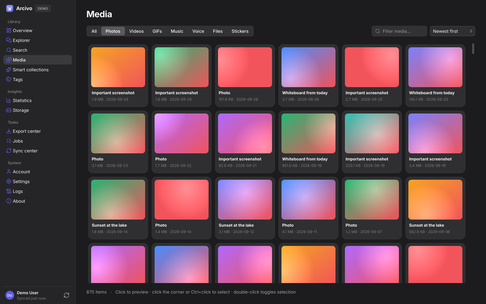<br><sub><b>Media</b> – photos, videos, music and files</sub></td>
<td>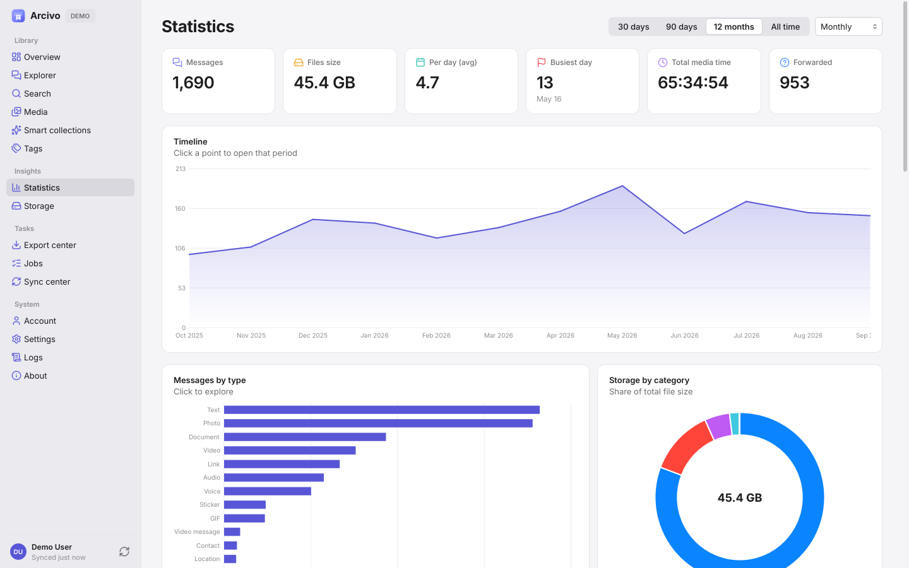<br><sub><b>Statistics</b> – trends and habits</sub></td>
</tr>
<tr>
<td>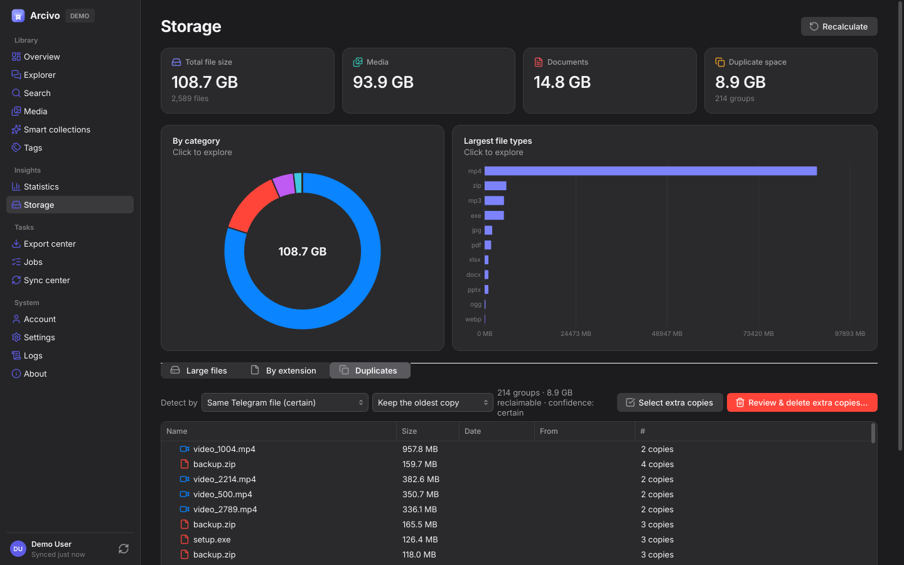<br><sub><b>Storage</b> – large files and duplicates</sub></td>
<td>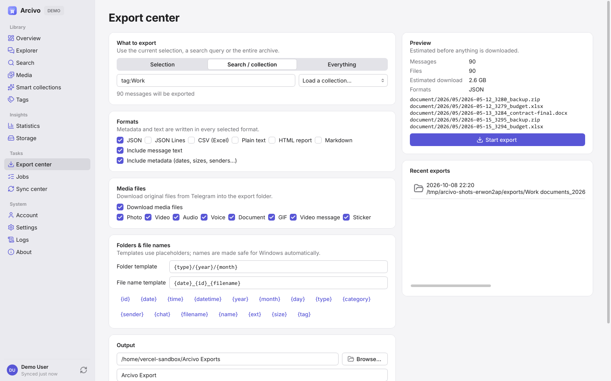<br><sub><b>Export center</b> – open formats, templates, media</sub></td>
</tr>
<tr>
<td>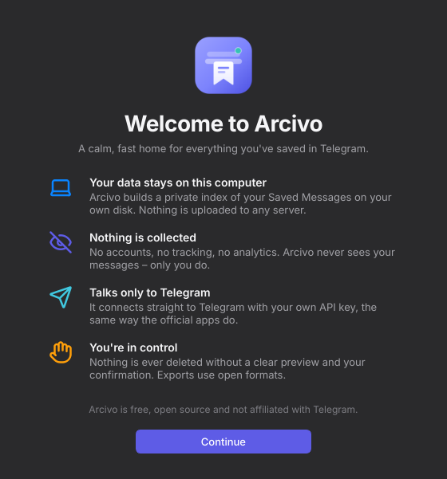<br><sub><b>Welcome</b> – first-run introduction</sub></td>
<td>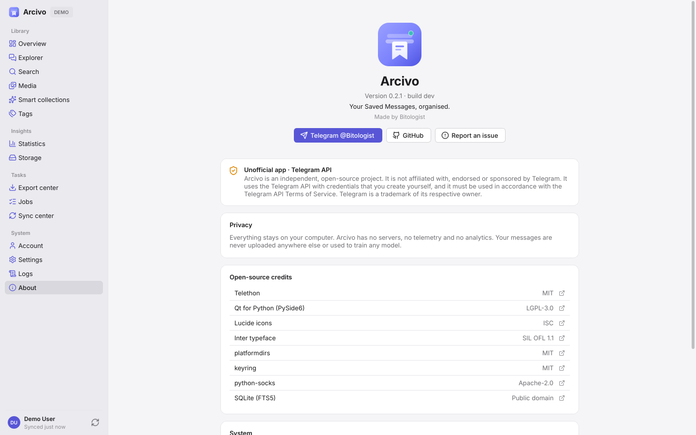<br><sub><b>About</b> – version, developer and diagnostics</sub></td>
</tr>
</table>

More in [`docs/images/screenshots`](docs/images/screenshots) (every page in both themes – generated
from demo data by `scripts/screenshots.py`).

## Install

**Requirements:** Windows 10 or 11 (64-bit). About 250 MB disk space plus your index/cache.
The installer and portable builds include everything they need. Running or building from source needs **Python 3.14 or newer** (minimum: 3.14).

| Option | How |
|---|---|
| **Installer** (recommended) | Download `Arcivo-<version>-Setup-x64.exe` from [Releases](https://github.com/sadult/arcivo/releases) and run it. Installs per-user (no admin) and adds two Start-menu shortcuts – **Arcivo** (console home screen) and **Arcivo Dashboard** (desktop app) – plus optional desktop icons and `arcivo` on PATH. |
| **Portable** | Download `Arcivo-<version>-portable-x64.zip`, unzip anywhere (e.g. a USB drive), run `Arcivo.exe` (console) or `ArcivoDashboard.exe` (desktop app). Everything is stored in `ArcivoData\` next to it. |
| **From source** | `pip install "arcivo @ git+https://github.com/sadult/arcivo"` (**Python 3.14+**), then `arcivo` (console menu) or `arcivo gui`. |

Verify downloads with `SHA256SUMS.txt` from the release. Unsigned builds may show a SmartScreen prompt
(*More info → Run anyway*).

## Getting your Telegram API credentials

Telegram requires every third-party app user to use **their own** API credentials:

1. Open <https://my.telegram.org> and log in with your phone number (the code arrives in your Telegram app).
2. Go to **API development tools**.
3. Create an application – any title/short name (e.g. "My Arcivo"), platform *Desktop*. URL can be empty.
4. Copy **App api_id** (a number) and **App api_hash** (32 characters). Keep them private.

Arcivo stores them in the Windows credential vault. See Telegram's
[official guide](https://core.telegram.org/api/obtaining_api_id) and [API Terms of Service](https://core.telegram.org/api/terms).

## First run

1. Start **Arcivo Dashboard** → a short *Welcome* sheet explains what the app does and that it uses the Telegram API.
2. Enter your **API ID / API hash** → your **phone number** (international format, e.g. `+98912…`) → the **login
   code** sent to your Telegram app → your **2-step verification password** if you set one.
3. The initial sync starts automatically. You can use the app while it runs; it can be paused and resumes where it
   left off.
4. Explore! Try `Ctrl+K`, the Dashboard cards, or a search like `type:audio sort:size`.

Prefer the terminal? Start **Arcivo** (`Arcivo.exe` / `arcivo`) and choose *Sign in*.

**Just looking?** Run `ArcivoDashboard.exe --demo` (or `arcivo gui --demo`) for a fully working app with synthetic data.

## Console app (Arcivo.exe)

`Arcivo.exe` (or `arcivo` with no arguments) opens a home screen in the terminal. Use ↑/↓ and Enter, or press the number:

```text
1  Sign in                 5  Account & storage
2  Open dashboard          6  Proxy settings
3  Check connection        7  Sign out
4  Sync now                8  About & privacy        0  Exit
```

The status panel shows the signed-in account, the proxy and the last sync. Every menu item is also a normal command
(see [Command line](#command-line)).

## Proxy & filtered networks

If Telegram is blocked on your network, sign-in or sync can hang. Run **Check connection** (`arcivo doctor`) – it
tests credentials, proxy, data-center reachability, the MTProto handshake and your session, and tells you what to fix.

Then set a proxy in *Settings → Network*, the console *Proxy settings* menu, or:

```text
arcivo proxy set socks5 127.0.0.1 1080          # SOCKS5 (e.g. a local VPN/V2Ray client)
arcivo proxy set http 127.0.0.1 8080
arcivo proxy set "https://t.me/proxy?server=…&port=…&secret=…"   # MTProto link
arcivo proxy show | off
```

## Command line

```text
arcivo                                # console home screen (menu)
arcivo doctor                         # connection diagnostics (proxy, DC reachability, session)
arcivo proxy show|set|off             # SOCKS5 / HTTP / MTProto proxy
arcivo login                          # interactive sign-in (API ID/hash, phone, code, 2FA)
arcivo status                         # account, session, connection, sync state
arcivo sync [--mode auto|incremental|initial|full]
arcivo search "type:audio size:>20MB" [--limit 20] [--sort size] [--json] [--count]
arcivo export "tag:work" --format json,html --media --out D:\Backup [--delete-after]
arcivo delete "type:sticker"          # shows a review, then asks you to type the count to confirm
arcivo stats [--range 30d|90d|1y|all] [--bucket month] [--json]
arcivo storage [--duplicates media_id|name_size|size_duration|hash]
arcivo tags list | create <name> | apply <name> <query> | remove <name> <query> | delete <name>
arcivo collections list | create <name> <query> | run <name> | delete <name>
arcivo db info|check|vacuum|backup|migrate|reset-index      arcivo cache info|clear
arcivo config show|get|set|path       arcivo logs [--tail 200] [--level error] [--export file.log]
arcivo gui [--demo]                   arcivo --demo <command>     # any command on synthetic data
arcivo logout
```

Run `arcivo <command> -h` for options. On the installed build the command is `Arcivo.exe` (added to PATH as `arcivo` if you chose that option).

## Search syntax

```text
words "exact phrase"          type:audio,voice      ext:pdf,docx       mime:image/*
sender:@user | sender:"Name"  chat:"Channel"         domain:github.com  filename:report
after:2026-01-01  before:2026-02  date:2025  date:2025-01..2025-06  date:last7d
size:>50MB  size:10MB..100MB  duration:>5m  tag:work  -tag:archive
has:link|media|caption|tag|note   is:flagged|starred|forwarded|album|edited|deleted
type:audio OR type:voice   ( … )   sort:size|date-asc|duration
```

Full reference: [docs/search-syntax.md](docs/search-syntax.md) or `arcivo search-help` / F1 in the app.

## Privacy & security

- **Local-first.** Your index, cache, exports and logs stay on your PC. No telemetry, no analytics, no third-party
  servers – Arcivo talks only to Telegram.
- **Secrets protected.** Session and API credentials live in Windows Credential Manager (or a DPAPI-encrypted
  file); logs automatically redact phone numbers, hashes, codes and tokens.
- **Nothing happens without you.** Arcivo never deletes or modifies anything on Telegram unless you start it,
  review it, and confirm it. Telegram deletions cannot be undone – the app says so before you confirm.
- **No AI training.** Your data is never collected or used to train models.
- **Where is my data?** Installed: `%APPDATA%\Arcivo` (settings) and `%LOCALAPPDATA%\Arcivo` (index, cache,
  logs). Portable: `ArcivoData\`. *Settings → Storage & database* shows the paths and maintenance tools.
- **Signing out** (*Account → Log out* / `arcivo logout`) ends the Telegram session and removes it from this PC.

Report vulnerabilities privately – see [SECURITY.md](SECURITY.md).

## Building from source

> **Minimum Python version: 3.14** (`py -3.14 --version`). Older versions are not supported.

**One click (Windows):** double-click **`build.bat`** in the project folder. It finds Python 3.14+, installs the
build dependencies, and writes `dist\Arcivo\Arcivo.exe`, `dist\Arcivo\ArcivoDashboard.exe`, the portable ZIP and –
if [Inno Setup 6+](https://jrsoftware.org/isinfo.php) is installed – the Setup installer. Run `build.bat test` to run
the test suite first. If Inno Setup is in an unusual folder, set `ISCC_PATH` at the top of `build.bat`.

**Manually:**

```powershell
git clone https://github.com/sadult/arcivo; cd arcivo
py -3.14 -m venv .venv; .venv\Scripts\activate
pip install -e ".[dev]"
arcivo gui --demo                     # run
pytest                                # tests (set QT_QPA_PLATFORM=offscreen for headless GUI tests)
powershell -ExecutionPolicy Bypass -File scripts\build.ps1   # → dist\ installer, portable ZIP, app folder
```

Details: [docs/building.md](docs/building.md). Releases are built by GitHub Actions on tag push.

<details>
<summary><b>Project structure</b></summary>

```text
src/arcivo/
  core/          paths, config, logging + redaction, errors, events
  domain/        dataclasses (MessageRecord, SearchSpec, Tag, Job …)
  db/            SQLite connection + migrations/*.sql (FTS5)
  repositories/  SQL per aggregate
  search/        query language → SQL
  telegram/      gateway protocol, Telethon gateway, mapper, back-off, fake gateway
  auth/          sign-in state machine, credential stores (keyring / DPAPI)
  export/        writers (json, jsonl, csv, txt, html, md) + naming templates
  jobs/          job manager (pause/resume/cancel, persistence)
  services/      sync, search, export, delete, analytics, storage, organisation, cache, account
  cli/           `arcivo` command, console home screen, doctor
  gui/           PySide6 app: pages/, widgets/, theme/, main_window, login_dialog
  i18n/          translator + English catalog
  assets/        brand, fonts (Inter), icons (Lucide)
tests/           unit, integration (fake gateway), gui (offscreen smoke)
packaging/       PyInstaller spec, Inno Setup script
scripts/         build.ps1, screenshots, brand/cover generators, sample DB
docs/            architecture, data model, API strategy, auth flow, IA, design system, ADRs
```
</details>

## Documentation

[Architecture](docs/architecture.md) · [Data model](docs/data-model.md) · [Telegram API strategy](docs/telegram-api-strategy.md) ·
[Auth flow](docs/auth-flow.md) · [UI information architecture](docs/ui-information-architecture.md) ·
[Design system](docs/design-system.md) · [Search syntax](docs/search-syntax.md) · [Building](docs/building.md) ·
[Roadmap](docs/roadmap.md) · [ADRs](docs/adr/)

## FAQ

<details><summary>Why do I need my own API ID?</summary>
Telegram's terms require each third-party client user to register their own credentials. It takes a minute at my.telegram.org and keeps you in control.</details>
<details><summary>Can Arcivo read my other chats?</summary>
Arcivo only reads your <b>Saved Messages</b>. It does not index, scrape or modify other chats.</details>
<details><summary>Is it safe to delete from Arcivo?</summary>
Deletion goes through a review list, a typed confirmation and a job with a report. Deleted messages cannot be restored by anyone, so export first if unsure – the Export center can offer deletion only after a verified export.</details>
<details><summary>I got "Telegram asked to wait N seconds".</summary>
That is Telegram's rate limit (FLOOD_WAIT). Arcivo waits automatically for short limits and pauses the job for long ones – just resume later.</details>
<details><summary>Does it work on macOS/Linux?</summary>
The code is cross-platform and runs from source (<code>pip install</code>); official packages are Windows-only for now.</details>

## Contributing

Bug reports and pull requests are welcome – please read [CONTRIBUTING.md](CONTRIBUTING.md) and the
[Code of Conduct](CODE_OF_CONDUCT.md). Use demo data for screenshots and never share sessions or API hashes.

## Developer

Made by **Bitologist** – Telegram [@Bitologist](https://t.me/Bitologist) · GitHub [sadult/arcivo](https://github.com/sadult/arcivo).

## License

[MIT](LICENSE) © Bitologist. Third-party components and fonts: [THIRD_PARTY_NOTICES.md](THIRD_PARTY_NOTICES.md).

<sub>Telegram is a trademark of Telegram FZ-LLC. Arcivo is an independent project, not affiliated with or endorsed by
Telegram. Use it in accordance with the [Telegram API Terms of Service](https://core.telegram.org/api/terms).</sub>
