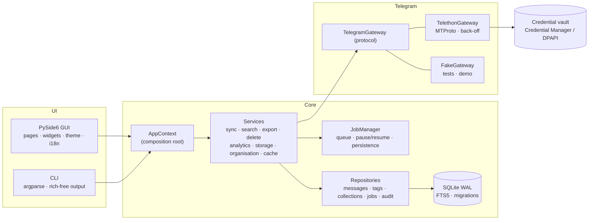

# Architecture

Arcivo is a local-first desktop application. Telegram is the **source of truth for messages**; Arcivo keeps a
**local index** (SQLite) that makes search, statistics and bulk operations fast and available offline.

## Layers

| Package | Responsibility | May import |
|---|---|---|
| `arcivo.core` | paths (installed vs portable), config (`Settings` dataclasses), logging with redaction, error codes, event bus | stdlib |
| `arcivo.domain` | plain dataclasses: `MessageRecord`, `SearchSpec`, `Tag`, `SmartCollection`, `Job` … | core |
| `arcivo.db` | connection management, numbered SQL migrations with automatic backup | core |
| `arcivo.repositories` | SQL for one aggregate each; no business rules | db, domain |
| `arcivo.search` | query-language parser → AST → parameterised SQL (FTS5 + filters) | domain |
| `arcivo.telegram` | `TelegramGateway` protocol; Telethon implementation; mapper Telethon → `MessageRecord`; back-off & error translation; fake gateway | core, domain |
| `arcivo.auth` | login state machine (API credentials → phone → code → 2FA), credential stores | telegram, core |
| `arcivo.export` | writers (JSON, JSONL, CSV, TXT, HTML, Markdown) and file-name templating | domain |
| `arcivo.jobs` | job manager: concurrency, pause/resume/cancel, checkpoints, persistence & recovery after restart | repositories |
| `arcivo.services` | use-cases combining the above | everything above |
| `arcivo.cli`, `arcivo.gui` | presentation only | services via `AppContext` |

Rules enforced in review: the GUI never imports Telethon; services never import Qt; every Telegram call goes
through the gateway (so it is back-off-protected and fakeable).

## Threading model (GUI)

- The Qt event loop runs on the main thread.
- `CoreRuntime` owns a dedicated **asyncio thread**. Services and Telethon run there; the GUI submits coroutines
  with `runtime.submit()` and receives results via queued Qt signals.
- The `EventBus` publishes domain events (`sync.progress`, `job.updated`, `data.changed` …); `CoreRuntime`
  re-emits them on the UI thread, where pages mark themselves dirty and refresh lazily when visible.
- Python's cyclic GC is driven from the UI thread (`UiThreadGarbageCollector`) so Qt wrappers are never finalised
  on the worker thread.
- SQLite uses WAL; reads from the UI thread are short and indexed, writes happen in services.

## Jobs

Long operations (sync, export, delete, downloads) are jobs: persisted in `jobs`/`job_items`, resumable, with
progress (`items`, `bytes`, `phase`, `current`) and a final result/report. `ctx.checkpoint()` inside loops makes
pause/cancel cooperative. Interrupted jobs are marked *interrupted* on next start and can be retried; exports
skip files that already exist with the right size.

## Error handling

All failures are mapped to `ArcivoError` subclasses with stable codes (`invalid_code`, `rate_limited`,
`network`, `session_invalid`, `database` …). UI and CLI show a translated, actionable message (`errors.<code>`), while the
log keeps technical detail – redacted.

## Paths

| Mode | Config | Data (index, cache, logs, reports, vault fallback) |
|---|---|---|
| Installed | `%APPDATA%\Arcivo` | `%LOCALAPPDATA%\Arcivo` |
| Portable (`portable.flag` next to exe) | `.\ArcivoData\config` | `.\ArcivoData\data` |
| Dev/CI (`ARCIVO_HOME`) | `$ARCIVO_HOME/config` | `$ARCIVO_HOME/data` |

See also: [data model](data-model.md), [Telegram API strategy](telegram-api-strategy.md), [auth flow](auth-flow.md),
[UI information architecture](ui-information-architecture.md), [design system](design-system.md), [ADRs](adr/).
