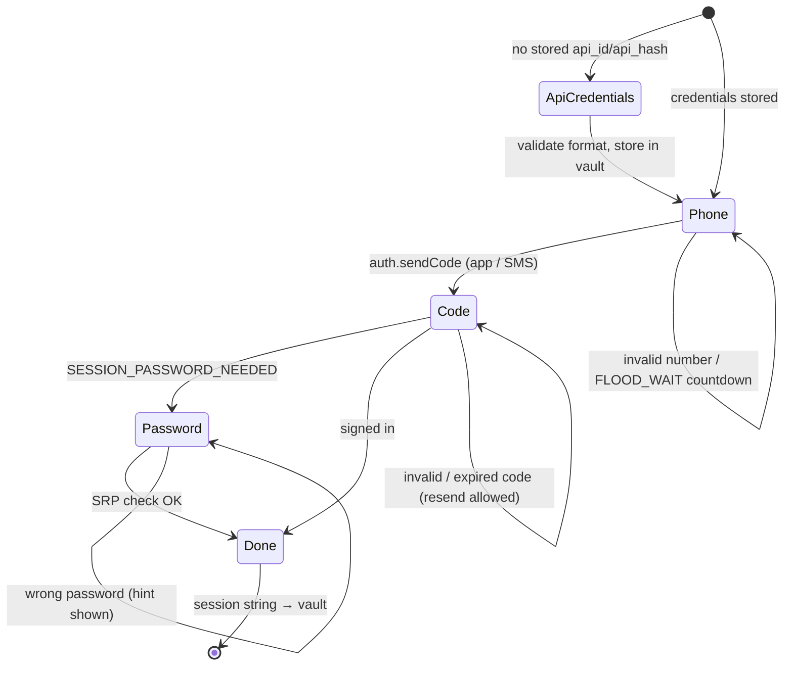

# Authentication flow

Sign-in is a small state machine shared by the CLI (`arcivo login`) and the GUI wizard.

| Step | Input | Stored? | Errors handled |
|---|---|---|---|
| API credentials | `api_id` (digits), `api_hash` (32 hex) from my.telegram.org | Yes – vault | format validation, `API_ID_INVALID` |
| Phone | international format (`+98…`) | Masked copy for display only | `PHONE_NUMBER_INVALID`, `PHONE_NUMBER_BANNED`, flood wait |
| Code | 5–6 digits from the Telegram app or SMS | No | invalid/expired code, resend |
| 2FA password | cloud password (hint displayed) | **Never** | wrong password |
| Done | – | Telethon `StringSession` → vault | – |

## Storage

`open_store("auto")` picks the most secure backend available: **keyring** (Windows Credential Manager) →
**DPAPI** file (`secure/<profile>.dpapi`, encrypted with the user's Windows logon) → private file (0600,
dev/CI only). The session string grants full account access, so it never touches the config file, logs (redacted
by pattern) or exports.

## Logout

`arcivo logout` / *Account → Log out* calls `auth.logOut`, deletes the session from the vault and (optionally)
clears the media cache. The local index can be kept or removed. The user is reminded that sessions can also be
ended from *Telegram → Settings → Devices*.
